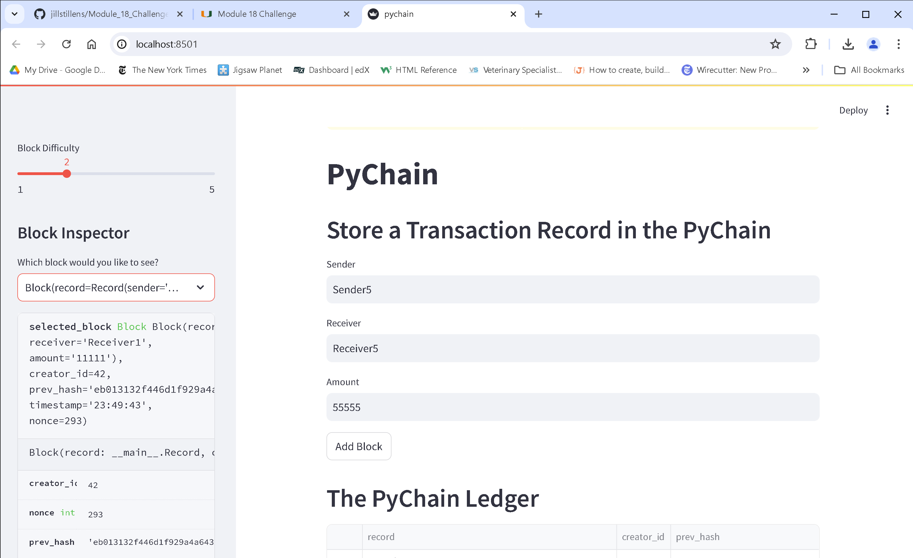
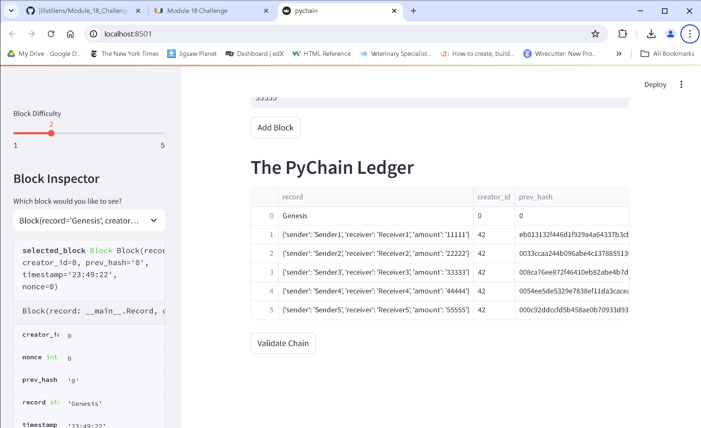
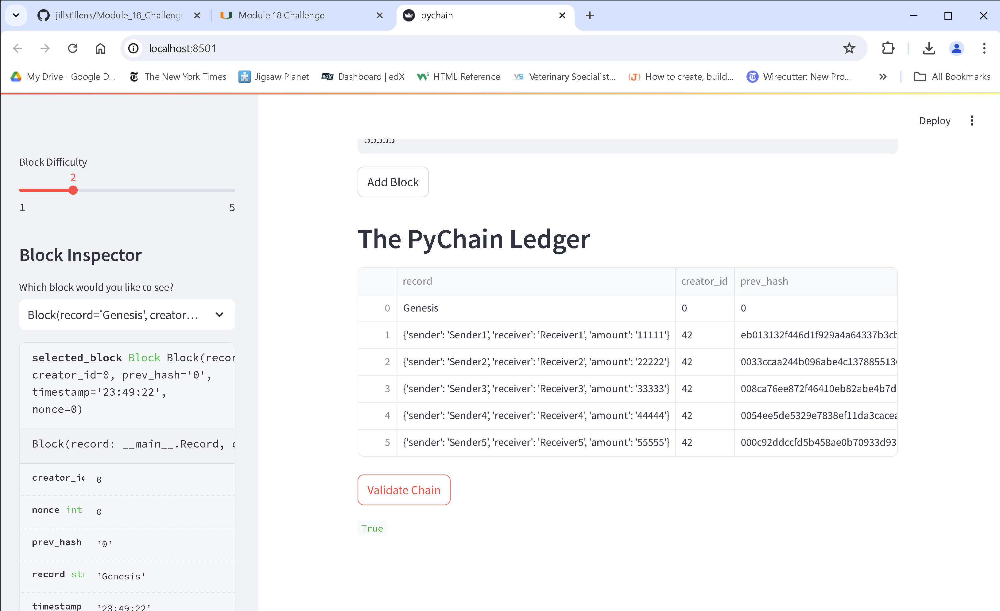

# Module_18_Challenge
See bottom of Readme for requested screenshots.
## Requirements
**Step 1: Create a Record Data Class (20 points)**

To receive all points, you must:

* Successfully define a new class named Record. (10 points)
* Implement the required class attributes for the Record class. (10 points)

**Step 2: Modify the Existing Block Data Class to Store Record Data (20 points)**

To receive all points, you must:

* Rename the data attribute in the Block class to record. (10 points)

* Set the data type of the record attribute to Record. (10 points)

**Step 3: Add Relevant User Inputs to the Streamlit Interface (20 points)**

To receive all points, you must:

* Add the correct user inputs for getting the sender, receiver, and amount. (10 points)

* Correctly update the Add Block button functionality. (10 points)

**Step 4: Test the PyChain Ledger by Storing Records (10 points)**

To receive all points, you must:

* Test the functionality of your chain. In the README.md file for your GitHub repository, include a screenshot that contains a blockchain consisting of several blocks. (5 points)

* Confirm that your blockchain is valid. In the README.md file of your GitHub repository, include a screenshot of the Streamlit application page displaying “Blockchain is Valid.” (5 points)

**Coding Conventions and Formatting (10 points)**

To receive all points, your code must:

* Place imports at the top of the file, just after any module comments and docstrings, and before module globals and constants. (3 points)

* Name functions and variables with lowercase characters, with words separated by underscores. (2 points)

* Follow DRY (Don't Repeat Yourself) principles, creating maintainable and reusable code. (3 points)

* Use concise logic and creative engineering where possible. (2 points)

**Deployment and Submission (10 points)**

To receive all points, you must:

* Submit a link to a GitHub repository that’s cloned to your local machine and that contains your files. (4 points)

* Use the command line to add your files to the repository. (3 points)

* Include appropriate commit messages for your files. (3 points)

**Comments (10 points)**

To receive all points, your code must:

* Be well commented with concise, relevant notes that other developers can understand. (10 points)

# Screen Shots

## Screenshot showing input fields
This wasn't asked for, but wasn't visible in my other screenshots so included it here:

## Screenshot showing Blockchain

## Screenshot showing Valid message

